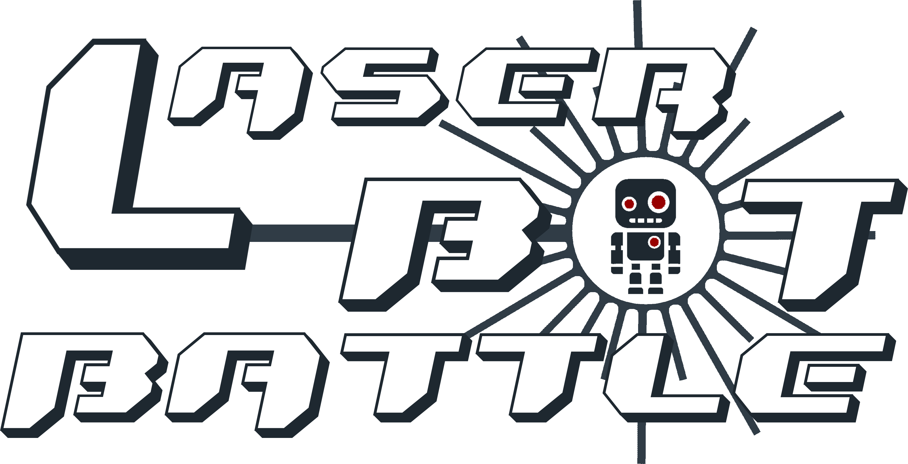

A <a href="http://www.ros.org">ROS</a> based application for wirelessly controlling robots and let them fight with lasers.

---

*This README is still a work in progess.*
*Further information about installation, usage and contribution method will be introduced after initial steps of development.*

## Table of Contents
- [Installation](#installation)
    - [Web Server](#web-server)
    - [Raspberry](#raspberry)
    - [Arduino](#arduino)
- [High Level Architecture](#high-level-architecture)
    - [Web Server](#web-server)
    - [Raspberry](#raspberry)
    - [Arduino](#arduino)
- [Usage](#usage)
- [Contributing](#contributing)
- [History](#history)
- [Credits](#credits)
- [License](#license)

## Installation

  ### Web Server
  TODO (  - Provide to the user a Docker image with all the necessary ROS components intalled to be run by the web server, such that allowing the communication with robots.  
          - Provide to the user the installation commands for ROS.
          In this way the user can choose one of the two options.)

  ### Raspberry 
  TODO (  - Provide the Docker image to be loaded to the raspberry containing ubuntu 16.04 and other ROS packages)

  ### Arduino 
  TODO (  - Provide the Sketch to be loaded to Arduino Board containing the Robot application to be run)

## High Level Architecture

  ### Web Application
  It is the web application for the users to log-in, command the robot and check battle status. 
  
  ### Web Server
  It is the host initiating the ROS network (roscore launched here). It is used in order to receive Post requests from clients (browsers) and to forward them to robots raspberry, in the form of ROS messages and viceversa. Moreover it is in charge of updating battle status (robot life, logged users, actions to be performed in response to received commands).

  ### Raspberry 
  It generates a ROS node (robot) exchanging messages with the ROS master and the Arduino board. It is used to forward commands coming from the Server to Arduino (performing the proper actuations) and to retrieve sensors notification from Arduino to be forwarded to the Server (updating battle status).

  ### Arduino 
  It is used to drive the motors and the IR emitter, in response of Raspberry requests. It is provided with IR sensors, such that detecting and notifying when a robot is hit.

## Usage

TODO (Describe the commands to move the robots and make them fighting)

## Contributing

TODO

## History

TODO

## Credits

TODO

## License

This project is licensed under the BSD 3 License - see the [LICENSE](LICENSE) file for details.
